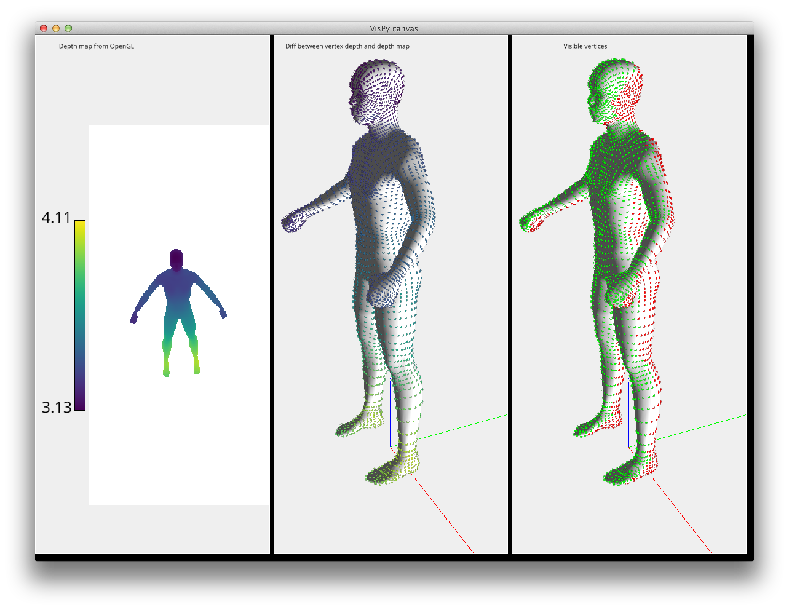

================================================
Mesh vertex visibility determination using Vispy
================================================

This demonstrates how, given a mesh and a camera, determine which vertices are
visible and which vertices are occluded by other faces of said mesh.

This uses the OpenGL depth buffer and basically re-does depth testing in
software using vispy.

See `main.py` and `depth.py` for more explanations.

